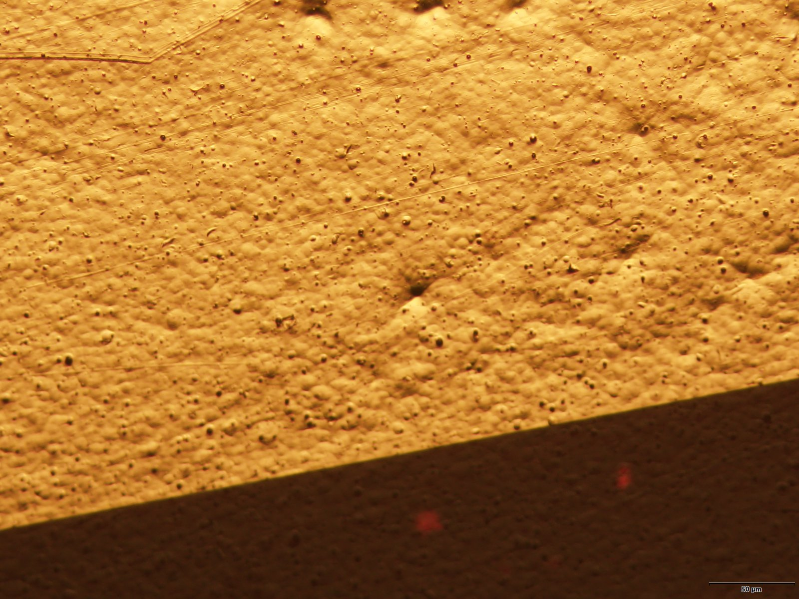

# Reunión Septiembre 2026

> **Fecha:** Lunes, 29 de septiembre de 2026  
> **Investigador:** David Ibarra Luna  
> **Proyecto:** EGOFETs - ICMAB-CSIC

---

## 1. Avances Agosto

### A. Fotolitografía Monocapa - Defectos Observados

**Protocolo actual:**
- Spin coating de OSC (semiconductor orgánico) sobre sustrato Kapton
- Exposición UV a través de máscara
- Revelado con solvente apropiado
- Caracterización eléctrica

**Defectos detectados en monocapa:**
- Inconsistencia en el espesor de la capa
- Problemas de adhesión al sustrato
- Variabilidad en las características eléctricas

**Galería de fotos:**

*Dispositivos bicapa - 18/09/2026*

*Pruebas de fotolitografía - 28/07/2026*

**Documentación de referencia:**
- `docs/OSC Ink Fabrication Protocol.docx`
- `docs/OFETs Fabrication Protocol.pdf`
- `docs/Deposició SC_MJ.docx`
- `docs/Preparació SC_MJ.docx`

---

### B. BAMS Controller - Deposition Tests

**Arquitectura del sistema:**

*Ver diagrama interactivo: [bams_architecture.html](assets/diagrams/bams_architecture.html)*

**Características principales:**
- Driver Python puro para NSC-A1 (Newmark Systems)
- Comunicación USB bulk sin DLL de vendor
- Handshake vendor específico (0x40/0x02) crítico para funcionamiento
- Context manager con cleanup automático
- Soporte completo para firmware V241BL

**Pruebas de deposición realizadas:**
- Control del motor stepper para movimiento preciso
- Secuencias de deposición programables
- Integración con sistema de caracterización

**Resultados eléctricos:**

**Transfer Curves:**

*Curvas de transferencia - Batch1_disp1_00 y Batch1_disp2_00*

**Output Curves:**

*Curvas de output - Regiones lineal y de saturación*

**Extracción de V_th:**
- Método: √|I_DS| vs V_GS
- Valores obtenidos: 0.024 V y 0.080 V
- R² > 0.995 en ambos casos

**Repositorio:** `/home/dibarra/Documentos/icmab/NSC-A1-controller`

---

### C. HDF5-Manager

**Problema identificado:**
- Software del Keithley genera archivos HDF5 que crashan al abrir
- Origin no soporta lectura de múltiples medidas en un solo HDF5
- Equipo tenía problemas para manejar datos de caracterización

**Solución desarrollada:**
Herramienta desktop standalone con NiceGUI que permite:

**Features:**
- **View:** Navegar estructura HDF5, inspeccionar atributos, previsualizar datasets
- **Edit:** Renombrar grupos y datasets, eliminar nodos
- **Merge:** Copiar grupos entre archivos, combinar mediciones
- **Export:** Convertir a CSV/Excel en 3 layouts:
  - Datasets side by side
  - One sheet per group
  - One file per group

**Distribución:**
- PyPI: `pip install hdf5-manager`
- Windows: `.exe` standalone
- Cross-platform: Python + NiceGUI

**Repositorio:** `/home/dibarra/Documentos/icmab/HDF5-Manager`

---

## 2. Becas - Postulación

### Resumen Comparativo

| Beca | Plazo | Dotación | Duración | Prioridad |
|------|-------|----------|----------|-----------|
| **Ramón Areces** | 2 sep - 2 oct 2026 | 35.000€/año + extras | 4 años | Alta |
| **FPU 2026** | 20 oct - 12 nov 2026 | ~1.200-1.500€/mes | 4 años | Alta |
| **La Caixa INPhINIT** | Ene-Feb 2027 | 35.800€/año | 4 años | Alta |

---

### Fundación Ramón Areces

**Estado:** ABIERTO  
**Plazo:** 2 septiembre - 2 octubre 2026

**Dotación:**
- Contrato predoctoral: 35.000€ brutos/año
- Estancias internacionales: 4.000€ por estancia (máx 2)
- Gastos investigación: 2.000€/año
- **Total potencial:** ~156.000€ en 4 años

**Requisitos clave:**
- Nota media > 7.5 (Máster: 8.28 ✓)
- NO haber tenido contrato predoctoral > 6 meses
- Matriculado/admitido en doctorado

**Documentación requerida:**
- [ ] Solicitud online
- [ ] Declaración responsable
- [ ] Título y expediente académico
- [ ] Justificante admisión doctorado
- [ ] Compromiso contratación ICMAB
- [ ] CV actualizado
- [ ] Memoria proyecto tesis
- [ ] CV abreviado directoras (Marta, Núria)

**Estrategia:**
- Preparar memoria del proyecto EGOFETs
- Coordinar con Marta y Núria para CVs y cartas
- Completar solicitud online antes del 2 de octubre

---

### FPU 2026

**Estado:** ABIERTA  
**Plazo participantes:** 20 octubre - 12 noviembre 2026  
**Plazo entidades:** 20 octubre - 20 noviembre 2026

**Dotación:**
- Contrato predoctoral: ~1.200-1.500€/mes netos
- Duración: hasta 4 años
- Estancias internacionales: financiación adicional

**Novedades 2026:**
- Gestión por AEI (antes MICIU)
- No necesario estar admitido en doctorado al solicitar
- Evaluación: 75% nota media + 25% trayectoria equipo

**Requisitos clave:**
- Nota media ponderada (Máster: 8.28 > mínimo 7.84 ✓)
- Compromiso de dedicación exclusiva
- Director de tesis designado

**Documentación requerida:**
- [ ] Equivalencia de nota media (PRIORITARIO)
- [ ] Formulario participante (20/10 - 12/11)
- [ ] Proyecto de tesis
- [ ] Cartas de recomendación
- [ ] ICMAB-CSIC firma solicitud (20/10 - 20/11)

**Estrategia:**
- Obtener equivalencia de nota media URGENTE
- Coordinar solicitud con Marta/Núria
- Preparar proyecto de tesis EGOFETs

---

### La Caixa INPhINIT 2027

**Estado:** Próxima convocatoria (Ene-Feb 2027)  
**Modalidad:** Retaining (elegible)

**Dotación:**
- Contrato: 35.800€/año
- Duración: 4 años
- Programa de formación transversal incluido

**Requisitos clave:**
- Máximo 4 años de experiencia investigadora
- NO haber iniciado doctorado previamente
- Certificado de inglés requerido
- Retaining: haber residido en España > 12 meses (✓ desde sept 2025)

**Documentación requerida:**
- [ ] Verificar elegibilidad modalidad Retaining
- [ ] Certificado de nivel de inglés
- [ ] Memoria proyecto de tesis
- [ ] Cartas de recomendación
- [ ] Admisión en programa de doctorado

**Estrategia:**
- Preparar certificado de inglés
- Redactar memoria del proyecto
- Solicitar cartas de recomendación
- Aplicar en convocatoria 2027 (Ene-Feb)

---

### Cronograma de Acciones

**Septiembre 2026:**
- [ ] **URGENTE:** Iniciar equivalencia de nota media
- [ ] **2 sep - 2 oct:** Solicitar Ramón Areces
- [ ] Preparar documentación FPU

**Octubre-Noviembre 2026:**
- [ ] **20 oct - 12 nov:** Solicitar FPU 2026
- [ ] **20 oct - 20 nov:** ICMAB firma solicitud FPU
- [ ] Preparar documentación INPhINIT 2027

**Enero-Febrero 2027:**
- [ ] Solicitar La Caixa INPhINIT 2027

---

## 3. Propuesta de Proyecto

### Título Tentativo
**"Electrodos Orgánicos para Transistores Electroquímicos (EGOFETs): Desarrollo y Aplicaciones en Biosensado"**

### Objetivos Generales

1. **Desarrollar** metodología de fabricación de EGOFETs con electrodos orgánicos
2. **Optimizar** procesos de fotolitografía para monocapa y bicapa
3. **Caracterizar** eléctricamente los dispositivos fabricados
4. **Aplicar** los EGOFETs en aplicaciones de biosensado

### Metodología

**Fase 1: Optimización de fabricación**
- Pruebas de fotolitografía monocapa vs bicapa
- Control de variables: espesor, exposición, revelado
- Characterización morfológica (AFM, SEM)

**Fase 2: Caracterización eléctrica**
- Medición de transfer curves (V_th, movilidad)
- Medición de output curves (regiones lineal/saturación)
- Estabilidad y reproducibilidad

**Fase 3: Aplicaciones en biosensado**
- Funcionalización de superficie
- Detección de analitos biológicos
- Integración con sistemas de lectura

### Timeline Tentativo

| Mes | Actividad |
|-----|-----------|
| 1-6 | Optimización de fabricación |
| 7-12 | Caracterización eléctrica completa |
| 13-18 | Aplicaciones en biosensado |
| 19-24 | Redacción de tesis |

### Impacto Esperado

- **Científico:** Contribución al campo de electrónica orgánica flexible
- **Tecnológico:** Desarrollo de sensores biológicos de bajo costo
- **Social:** Aplicaciones en diagnóstico médico point-of-care

---

## Anexos

### Recursos Disponibles

**Fotos de dispositivos:**
- `assets/photos/` - 21 imágenes de agosto-septiembre 2026
- Organizadas por fecha de fabricación

**Diagramas técnicos:**
- `assets/diagrams/bams_architecture.html` - Arquitectura del controller BAMS

**Figuras de caracterización:**
- `assets/figures/transfer_fig_0.png` - Curvas de transferencia
- `assets/figures/transfer_fig_1.png` - Linearización V_th
- `assets/figures/output_fig_2.png` - Curvas de output

**Documentación de protocolos:**
- `docs/OSC Ink Fabrication Protocol.docx`
- `docs/OFETs Fabrication Protocol.pdf`
- `docs/Deposició SC_MJ.docx`
- `docs/Preparació SC_MJ.docx`

### Próximos Pasos

1. Completar solicitud Ramón Areces (antes del 2 de octubre)
2. Obtener equivalencia de nota media (URGENTE para FPU)
3. Continuar optimización de fotolitografía monocapa
4. Expandir pruebas de deposición con BAMS controller
5. Preparar propuesta detallada de proyecto

---

**Generado:** 27 de septiembre de 2026  
**Contacto:** david.ibarra@icmab.es
