# Reunión Septiembre 2026

> **Fecha:** Lunes, 29 de septiembre de 2026  
David Ibarra Luna  
> **Proyecto:** EGOFETs - ICMAB-CSIC

---

## 1. Avances Agosto

### A. Fotolitografía Monocapa - Defectos Observados

**Protocolo actual:**
- Spin coating monocapa de fotoresina Shipley S1813
- Fotolitografía con Microwriter, revelado y evaporación
- Lift-Off con acetona, IPA con ultrasonido 15 min. Remoción manual con acetona y algodón.
- Caracterización eléctrica

**Defectos detectados en monocapa:**
- Inconsistencia en el espesor de la capa
- Problemas de remoción en el canal entre D-S
- La remoción con algodón es propensa a dañar el dispositivo

**Galería de fotos:**

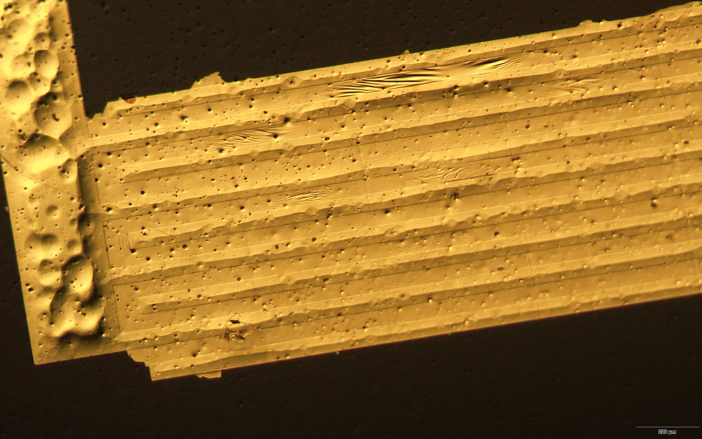
*Residuo de Au en canal Source-Drain después de lift-off monocapa*

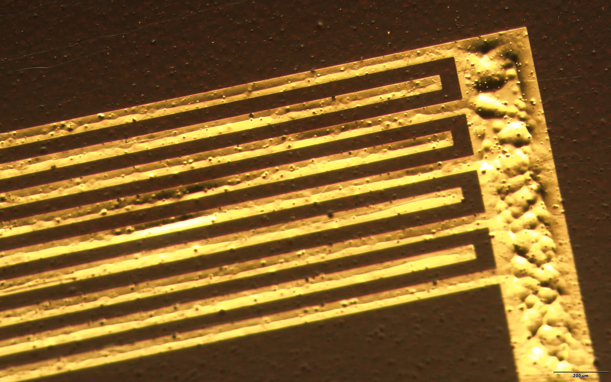
*Remoción manual de residuos con algodón - puede dañar el patrón*

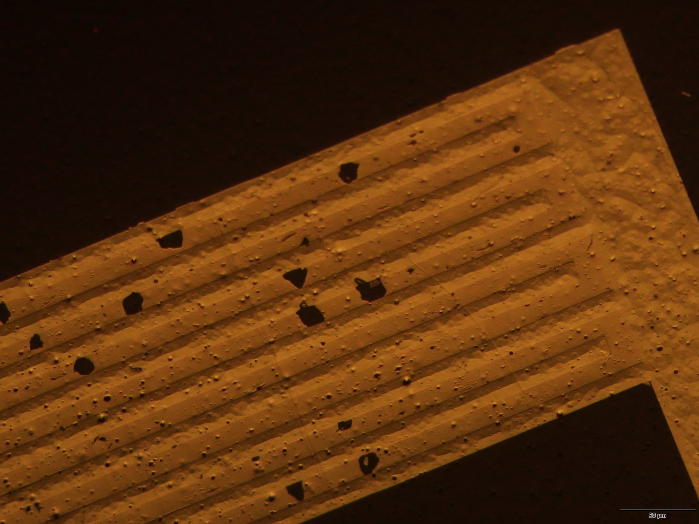
*Pruebas de fotolitografía monocapa - Julio 2026*

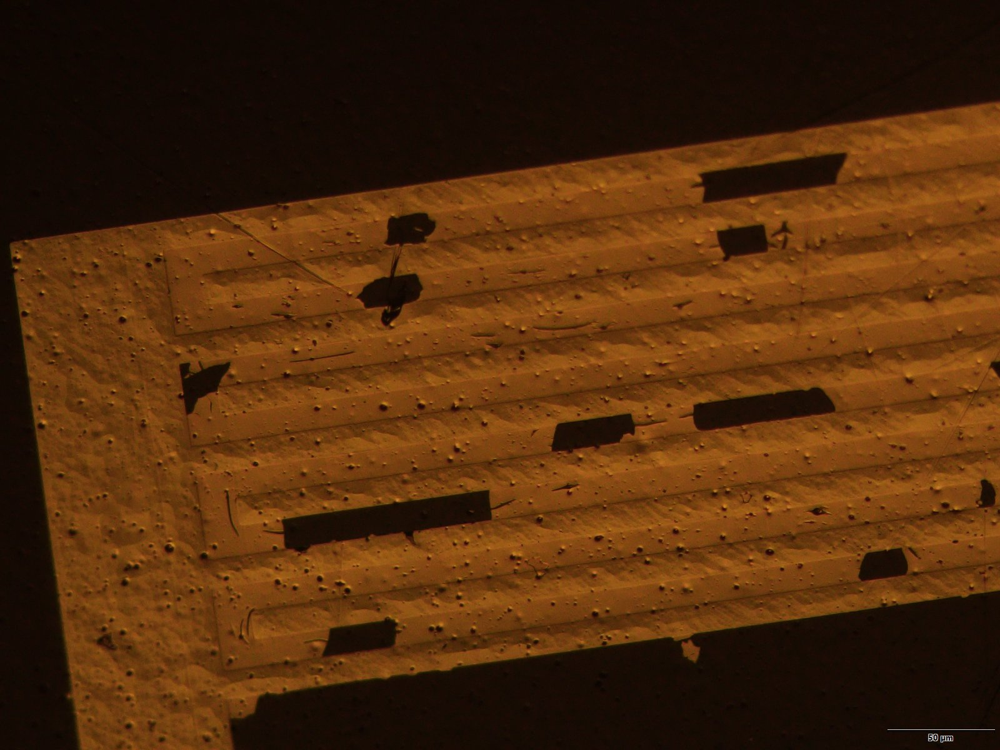
*Dispositivos monocapa - Julio 2026*

**Documentación de referencia:**
- `docs/OSC Ink Fabrication Protocol.docx`
- `docs/OFETs Fabrication Protocol.pdf`
- `docs/Deposició SC_MJ.docx`
- `docs/Preparació SC_MJ.docx`

---

### A2. Fotolitografía Bicapa (PMGI SF5 / S1813) - Ventajas

**Protocolo bicapa:**
- Capa inferior: PMGI SF5 (3000 RPM, prebake 170 °C / 5 min)
- Capa superior: Shipley S1813 (5000 RPM, soft bake 75 °C / 1 min)
- Revelado en MF-319 (60–90 s) genera *undercut* controlado
- Lift-Off con DMSO a 60 °C (1-2 h, sin ultrasonido)

**Resultados vs. monocapa:**

| Parámetro | Monocapa (S1813) | Bicapa (PMGI + S1813) |
|-----------|-------------------|------------------------|
| Dispositivos con Au residual en canal | 12/12 | 5/12 |
| Perfil de pared lateral | Vertical | *Undercut* (re-entrante) |
| Remoción manual con algodón | Necesaria, alto riesgo de daño | Resistente, removable sin daño |
| Riesgo de daño al patrón | Alto | Bajo |

**Ventajas clave:**
- El perfil *undercut* rompe la continuidad del metal en los bordes, evitando puentes
- El grabado bicapa es más resistente: es posible remover restos con algodón **sin dañar el patrón**
- DMSO a 60 °C penetra mejor que acetona bajo el metal (menor tensión superficial, sin ultrasonido)
- Compatible con sustratos Kapton

**Márgenes de optimización pendientes:**
- Temperatura de prebake PMGI (150–190 °C) → controla tasa de *undercut*
- RPM del spin coating PMGI → controla espesor de capa inferior
- Tiempo de exposición a DMSO → acelerar lift-off sin dañar electrodos

**Documentación:** `docs/photolito_protocol/bilayer_protocol.tex`

**Galería de fotos:**

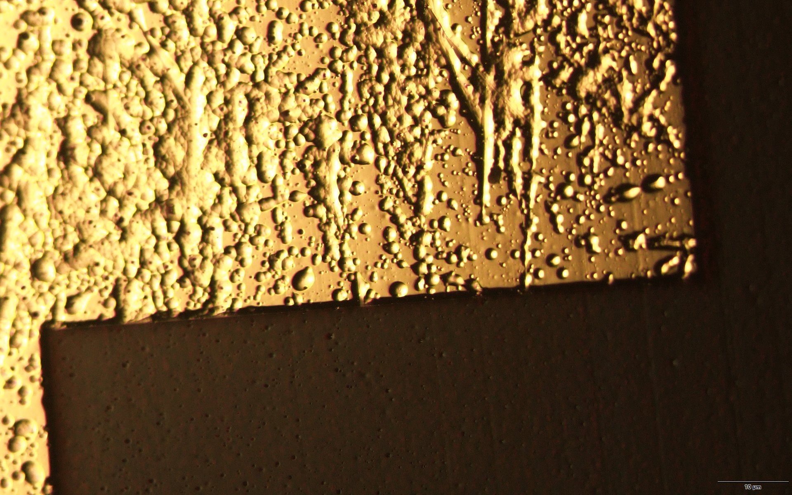
*Dispositivos bicapa recientes - 18/09/2026*

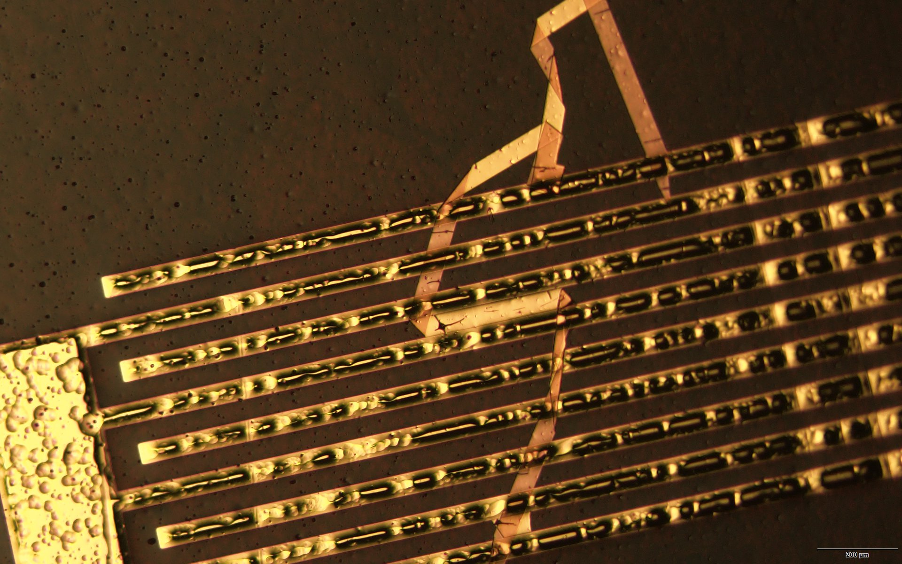
*Resultado lift-off con DMSO - canales limpios sin residuos*

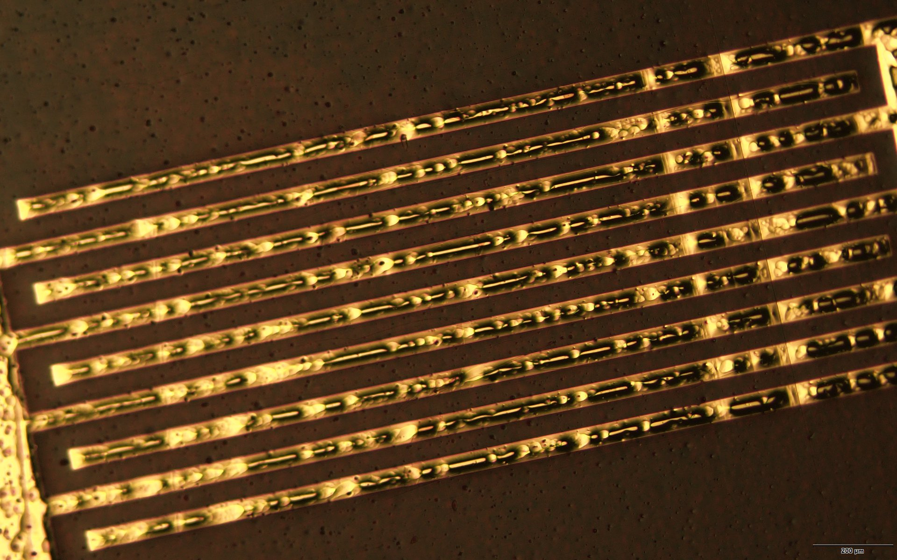
*Electrodos definidos con perfil undercut*

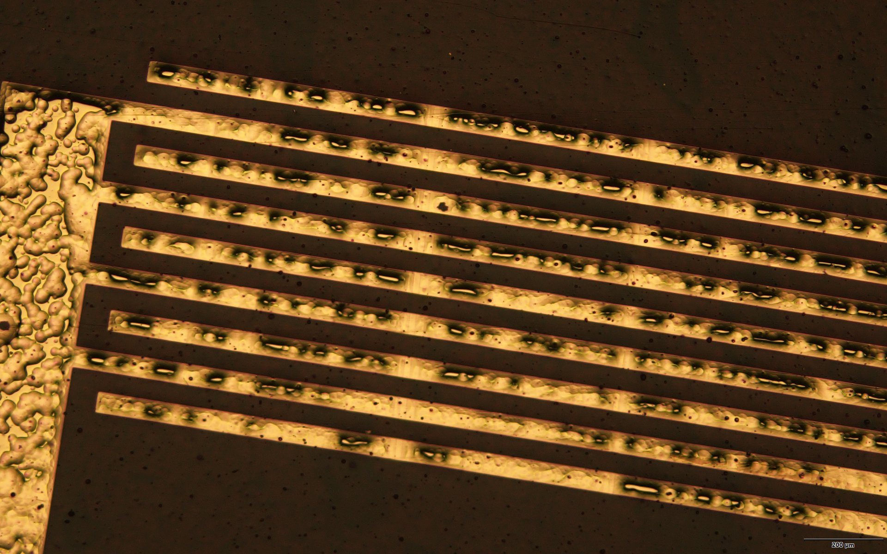
*Patrón de electrodos después de evaporación y lift-off*

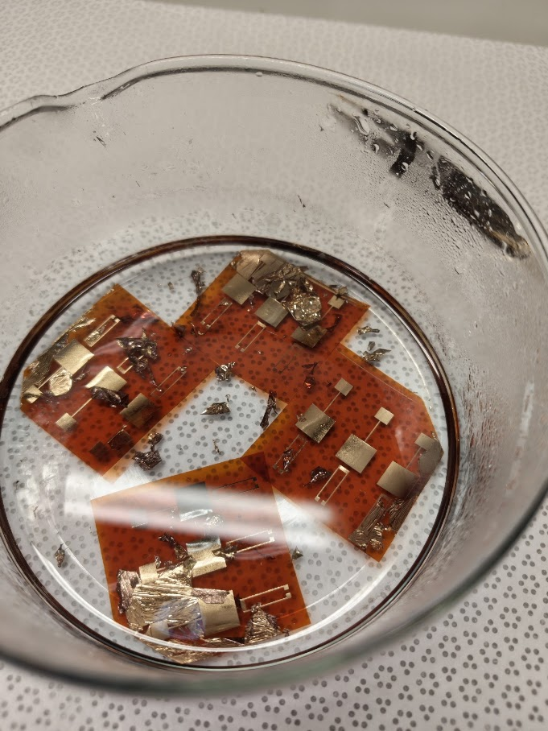
*Vista general de dispositivos bicapa - 18/09/2026*

---

### B. BAMS Controller - Deposition Tests

**¿Qué hace?**
Controla el motor stepper del sistema de deposición BAMS (NSC-A1, Newmark Systems) para mover la fuente de material durante la evaporación. Permite programar secuencias de deposición con velocidad y aceleración precisas, reemplazando el control manual.

**¿Cómo funciona?**
1. Se conecta al motor NSC-A1 por USB
2. Envía comandos de movimiento (adelante/atrás, velocidad, pasos)
3. El motor mueve la fuente de material sobre el sustrato
4. Permite secuencias programables para deposición uniforme

**¿Qué necesita para funcionar?**
- Computadora con puerto USB
- Python 3.8+
- Librería `pyusb` (comunicación USB sin drivers propietarios)
- Cable USB al motor NSC-A1
- Handshake específico (0x40/0x02) para inicializar comunicación

**Opciones de implementación en el laboratorio:**

| Opción | Ventajas | Desventajas |
|--------|----------|-------------|
| **PC dedicada** (nueva) | Máximo rendimiento, fácil mantenimiento | Costo elevado (~500-800€) |
| **Raspberry Pi 4** | Bajo costo (~80€), compacto, bajo consumo | Requiere configuración Linux, USB puede ser inestable |
| **PC antigua con Linux** | Reutiliza hardware existente, gratuito | Puede requerir actualización de puertos USB |

**Recomendación:** Raspberry Pi 4 con Ubuntu Server + interfaz web (NiceGUI) para control remoto desde cualquier dispositivo del laboratorio.

**Diagrama de arquitectura:**
[Ver diagrama interactivo](assets/diagrams/bams_architecture.html) (abrir en navegador)

**Interfaz gráfica:**

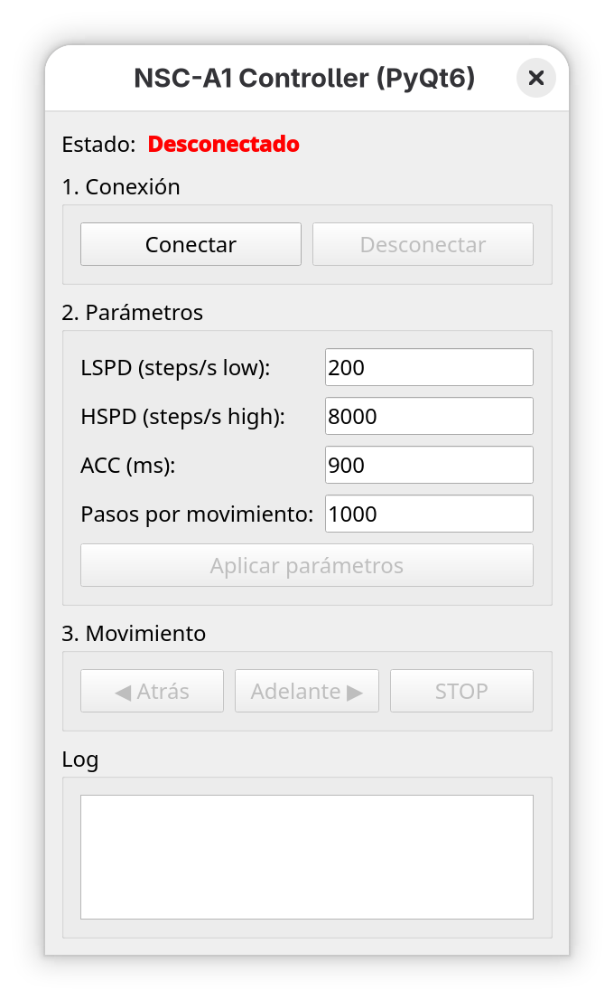
*Interfaz PyQt6 del controlador NSC-A1 - control de conexión, parámetros y movimiento*

**Video de demostración:**

<video controls width="100%">
  <source src="assets/photos/VID-20260827.mp4" type="video/mp4">
  Tu navegador no soporta el elemento de video.
</video>
*Demostración del controlador en operación - 27/08/2026*

**Resultados eléctricos:**

**Transfer Curves:**
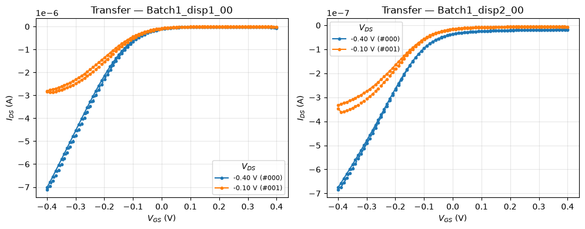
*Curvas de transferencia - Batch1_disp1_00 y Batch1_disp2_00*

**Output Curves:**
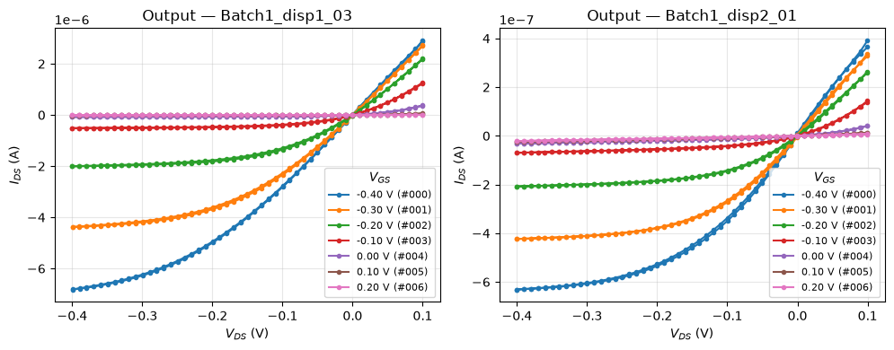
*Curvas de output - Regiones lineal y de saturación*

**Extracción de V_th:**
- Método: √|I_DS| vs V_GS
- Valores obtenidos: 0.024 V y 0.080 V
- R² > 0.995 en ambos casos

**Repositorio:** `/home/dibarra/Documentos/icmab/NSC-A1-controller`

---

### C. HDF5-Manager

**Problema identificado:**
- Software del Keithley genera archivos HDF5 que crashan al abrir
- Origin no soporta lectura de múltiples medidas en un solo HDF5
- Equipo tenía problemas para manejar datos de caracterización

**Solución desarrollada:**
Herramienta desktop standalone con NiceGUI que permite:

**Features:**
- **View:** Navegar estructura HDF5, inspeccionar atributos, previsualizar datasets
- **Edit:** Renombrar grupos y datasets, eliminar nodos
- **Merge:** Copiar grupos entre archivos, combinar mediciones
- **Export:** Convertir a CSV/Excel en 3 layouts:
  - Datasets side by side
  - One sheet per group
  - One file per group

**Distribución:**
- PyPI: `pip install hdf5-manager`
- Windows: `.exe` standalone
- Cross-platform: Python + NiceGUI

**Interfaz gráfica:**

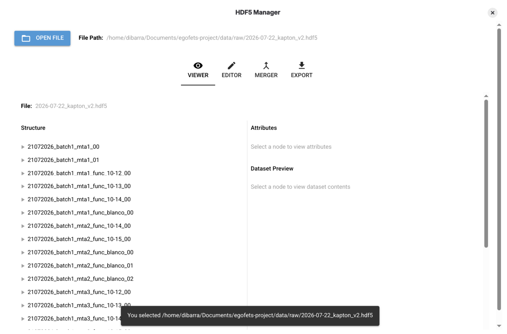
*Interfaz de HDF5 Manager mostrando estructura de archivo, atributos y vista previa de datasets*

**Repositorio:** `/home/dibarra/Documentos/icmab/HDF5-Manager`

---

## 2. Becas - Postulación

### Resumen Comparativo

| Beca | Plazo | Dotación | Duración |
|------|-------|----------|----------|
| **Ramón Areces** | 2 sep - 2 oct 2026 | 35.000€/año + extras | 4 años |
| **FPU 2026** | 20 oct - 12 nov 2026 | ~1.200-1.500€/mes | 4 años |
| **La Caixa INPhINIT** | Ene-Feb 2027 | 35.800€/año | 4 años |

---

### Fundación Ramón Areces

**Estado:** ABIERTO  
**Plazo:** 2 septiembre - 2 octubre 2026

**Dotación:**
- Contrato predoctoral: 35.000€ brutos/año
- Estancias internacionales: 4.000€ por estancia (máx 2)
- Gastos investigación: 2.000€/año
- **Total potencial:** ~156.000€ en 4 años

**Requisitos clave:**
- Nota media > 7.5 (Máster: 8.28 ✓)
- NO haber tenido contrato predoctoral > 6 meses
- Matriculado/admitido en doctorado

**Documentación requerida:**
- [ ] Solicitud online
- [ ] Declaración responsable
- [ ] Título y expediente académico
- [ ] Justificante admisión doctorado
- [ ] Compromiso contratación ICMAB
- [ ] CV actualizado
- [ ] Memoria proyecto tesis
- [ ] CV abreviado directoras (Marta, Núria)

**Estrategia:**
- Preparar memoria del proyecto EGOFETs
- Coordinar con Marta y Núria para CVs y cartas
- Completar solicitud online antes del 2 de octubre

---

### FPU 2026

**Estado:** ABIERTA  
**Plazo participantes:** 20 octubre - 12 noviembre 2026  
**Plazo entidades:** 20 octubre - 20 noviembre 2026

**Dotación:**
- Contrato predoctoral: ~1.200-1.500€/mes netos
- Duración: hasta 4 años
- Estancias internacionales: financiación adicional

**Novedades 2026:**
- Gestión por AEI (antes MICIU)
- No necesario estar admitido en doctorado al solicitar
- Evaluación: 75% nota media + 25% trayectoria equipo

**Requisitos clave:**
- Nota media ponderada (Máster: 8.28 > mínimo 7.84 ✓)
- Compromiso de dedicación exclusiva
- Director de tesis designado

**Documentación requerida:**
- [ ] Equivalencia de nota media (PRIORITARIO)
- [ ] Formulario participante (20/10 - 12/11)
- [ ] Proyecto de tesis
- [ ] Cartas de recomendación
- [ ] ICMAB-CSIC firma solicitud (20/10 - 20/11)

**Estrategia:**
- Obtener equivalencia de nota media URGENTE
- Coordinar solicitud con Marta/Núria
- Preparar proyecto de tesis EGOFETs

---

### La Caixa INPhINIT 2027

**Estado:** Próxima convocatoria (Ene-Feb 2027)  
**Modalidad:** Retaining (elegible)

**Dotación:**
- Contrato: 35.800€/año
- Duración: 4 años
- Programa de formación transversal incluido

**Requisitos clave:**
- Máximo 4 años de experiencia investigadora
- NO haber iniciado doctorado previamente
- Certificado de inglés requerido
- Retaining: haber residido en España > 12 meses (✓ desde sept 2025)

**Documentación requerida:**
- [ ] Verificar elegibilidad modalidad Retaining
- [ ] Certificado de nivel de inglés
- [ ] Memoria proyecto de tesis
- [ ] Cartas de recomendación
- [ ] Admisión en programa de doctorado

**Estrategia:**
- Preparar certificado de inglés
- Redactar memoria del proyecto
- Solicitar cartas de recomendación
- Aplicar en convocatoria 2027 (Ene-Feb)

---

### Cronograma de Acciones

**Septiembre 2026:**
- [ ] **URGENTE:** Iniciar equivalencia de nota media
- [ ] **2 sep - 2 oct:** Solicitar Ramón Areces
- [ ] Preparar documentación FPU

**Octubre-Noviembre 2026:**
- [ ] **20 oct - 12 nov:** Solicitar FPU 2026
- [ ] **20 oct - 20 nov:** ICMAB firma solicitud FPU
- [ ] Preparar documentación INPhINIT 2027

**Enero-Febrero 2027:**
- [ ] Solicitar La Caixa INPhINIT 2027

---

## 3. Propuesta de Proyecto

**"Electrodos Orgánicos para Transistores Electroquímicos (EGOFETs): Desarrollo y Aplicaciones en Biosensado"**

### Objetivos Generales

1. **Desarrollar** metodología de fabricación de EGOFETs con electrodos orgánicos
2. **Optimizar** procesos de fotolitografía para monocapa y bicapa
3. **Caracterizar** eléctricamente los dispositivos fabricados
4. **Aplicar** los EGOFETs en aplicaciones de biosensado

### Metodología

**Fase 1: Optimización de fabricación**

**Fase 2: Caracterización eléctrica**

**Fase 3: Aplicaciones en biosensado**

### Timeline Tentativo

| Mes | Actividad |
|-----|-----------|
| 1-6 | |
| 7-12 |  |
| 13-18 |  |
| 19-24 |  |

### Impacto Esperado

- **Científico:** Contribución al campo de electrónica orgánica flexible
- **Tecnológico:** Desarrollo de sensores biológicos de bajo costo
- **Social:** Aplicaciones en diagnóstico médico point-of-care

---

## Anexos

### Recursos Disponibles

**Fotos de dispositivos:**
- `assets/photos/` - 21 imágenes de agosto-septiembre 2026
- Organizadas por fecha de fabricación

**Diagramas técnicos:**
- `assets/diagrams/bams_architecture.html` - Arquitectura del controller BAMS

**Figuras de caracterización:**
- `assets/figures/transfer_fig_0.png` - Curvas de transferencia
- `assets/figures/transfer_fig_1.png` - Linearización V_th
- `assets/figures/output_fig_2.png` - Curvas de output

**Documentación de protocolos:**
- `docs/OSC Ink Fabrication Protocol.docx`
- `docs/OFETs Fabrication Protocol.pdf`
- `docs/Deposició SC_MJ.docx`
- `docs/Preparació SC_MJ.docx`

### Próximos Pasos

1. Completar solicitud Ramón Areces (antes del 2 de octubre)
2. Obtener equivalencia de nota media (URGENTE para FPU)
3. Optimizar fotolitografía bicapa (temperatura PMGI, RPM, tiempo DMSO)
4. Expandir pruebas de deposición con BAMS controller
5. Preparar propuesta detallada de proyecto

---

**Generado:** 27 de septiembre de 2026  
**Contacto:** david.ibarra@icmab.es
